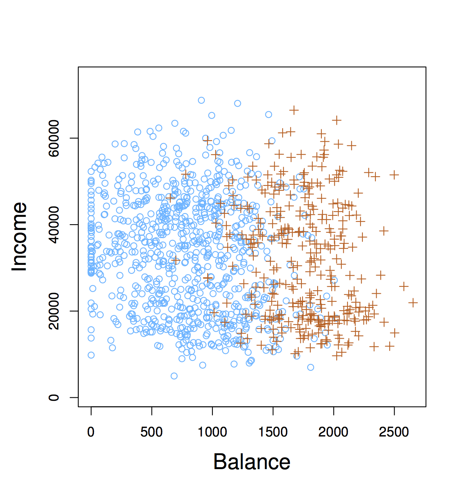
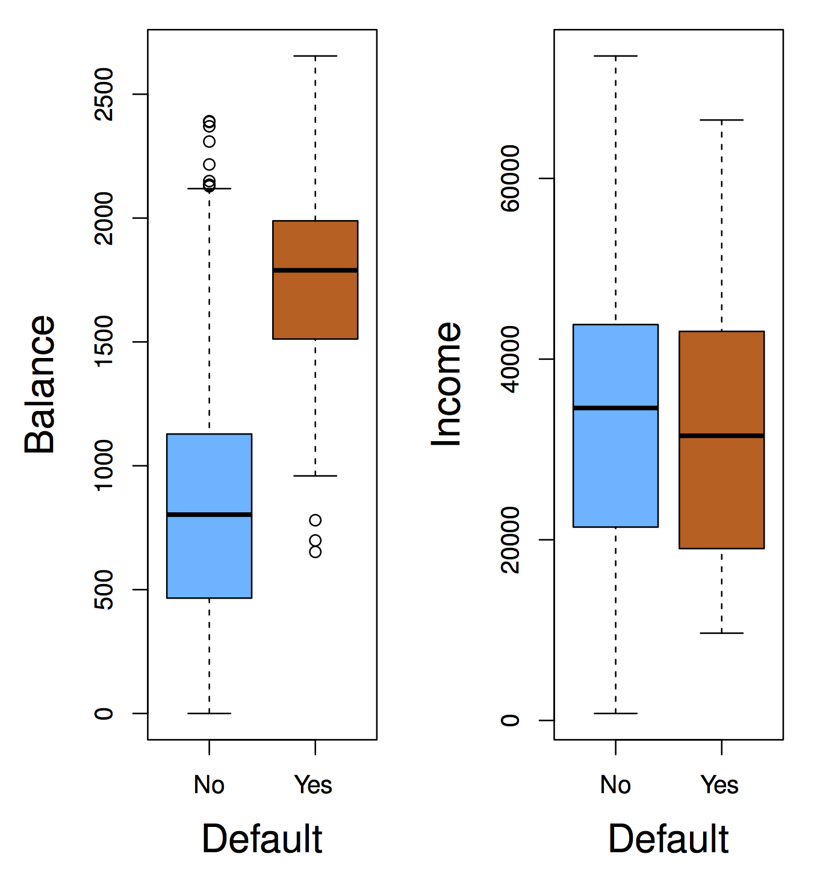
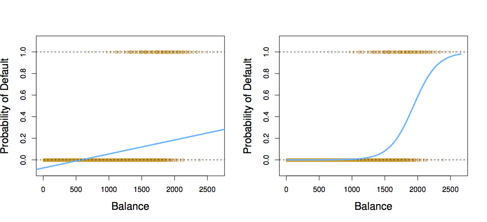

Classification
========================================================
author: Hector Corrada Bravo
date: CMSC498T: Intro Data Science


Example Classification Problem
========================================================

Mode choice of an individual to commute to work. Predictors: income, cost and time required for each of the alternatives: driving/carpooling,  biking, taking a bus, taking the train. Response: whether the individual makes their commute by car, bike, bus or train. Inference - shows how people value the price and time when considering their mode choice. 

Classification
===============

Can we predict $Y$, taking values from a set of classes, from predictors $\mathbf{X}$?

$(\mathbf{x}_1, y_1), \ldots, (\mathbf{x}_n, y_n)$ Training data as in regression

Goal is to predict **accurately** on **unseen** data.

Classification
===============



***



Why not linear regression?
============================

For multiple possible classes, if order and scale (units) don't make sense, then it's not a regression problem

$$
Y = 
\begin{cases}
1 & \textrm{if } \mathtt{stroke} \\
2 & \textrm{if } \mathtt{drug overdose} \\
3 & \textrm{if } \mathtt{epileptic seizure}
\end{cases}
$$

Why not linear regression?
===========================

For **binary** responses, it's a little better:

$$
Y = 
\begin{cases}
0 & \textrm{if } \mathtt{stroke} \\
1 & \textrm{if } \mathtt{drug overdose} \\
\end{cases}
$$

Fit with linear regression and _interpret_ as probability (e.g, if $\hat{y} > 0.5$ predict $\mathtt{drug overdose}$)

Why not linear regression?
=============================



Classification as probability estimation problem
=================================================

- Instead of modeling classes 0 or 1 directly, let's model $P(Y=1|X)$, and classify based on this probability.

- In general, classification approaches use _discriminant_ (think of _scoring_) functions to do classification.

- Logistic regression is **one** way of estimating this class probability $P(Y=1|X)$ (also denoted $p(x)$)

Classification as probability estimation problem
==================================================


 

Logistic regression
====================

- Basic idea is to build a **linear** model _related_ to $p(x)$, but linear regression directly (i.e. $p(x) = \beta_0 + \beta_1 x$) doesn't work. Why?

- Instead use _log-odds_:

$$
\log \frac{p(x)}{1-p(x)} = \beta_0 + \beta_1 x
$$

- Odds: ratio of probabilities
  - "two to one odds that Ted Cruz wins presidency" means "the probability that Ted Cruz wins is double the probability he loses"
  - So if odds = 2, $p(x)=2/3$. If odds = 1/2, $p(x)=1/3$. In general odds = $\frac{p(x)}{1-p(x)}$.
  
Logistic regression
=====================

1. Suppose an individual has a 16% chance of defaulting on her credit card payment. What are the odds that she will default?

2. On average, what fraction of people with an odds of 0.37 of defaulting on their credit card payment will in fact default?

Logistic regression
=====================

 


Logistic regression
=====================


```r
fit <- glm(default ~ balance, data=Default, family=binomial)
kable(summary(fit)$coef, digits=4)
```


|            | Estimate| Std. Error|  z value| Pr(>&#124;z&#124;)|
|:-----------|--------:|----------:|--------:|------------------:|
|(Intercept) | -10.6513|     0.3612| -29.4922|                  0|
|balance     |   0.0055|     0.0002|  24.9531|                  0|

Interpretation:
 - the **odds** that person defaults increase by $e^{0.05}$ for every dollar in balance
 - The **accuracy** of $\hat{\beta}_1$ as an estimate of the **population** parameter is given Std. Error

Logistic regression
=====================


|            | Estimate| Std. Error|  z value| Pr(>&#124;z&#124;)|
|:-----------|--------:|----------:|--------:|------------------:|
|(Intercept) | -10.6513|     0.3612| -29.4922|                  0|
|balance     |   0.0055|     0.0002|  24.9531|                  0|

Interpretation:
 - Z-value $\frac{\hat{\beta}_1}{\mathrm{SE}(\hat{\beta}_1)}$ plays the role of the t-statistic in linear regression: a scaled measure of our estimate (signal / noise)
 - The P-value is the probability of seeing a Z-value as large (e.g., 24.95) under the null hypothesis that **there is no relationship between balance and the probability of defaulting**, i.e., $\beta_1=0$ in the population
 
Logistic regression
=====================

- Again, an algorithm required to _estimate_ parameters $\beta_0$ and $\beta_1$.
- In logistic regression we use a **binomial** probability model: think of flipping a coin weighted by $p(x)$
- We _estimate_ parameters to **maximize** the likelihood of the observed training data under this coin flipping (binomial) model
- I.e.: solve the following optimization problem

$$
\max_{\beta_0, \beta_1} \sum_{i:\, y_i=1} log(p(x_i)) + \sum_{i: y_i=0} log(1-p(x_i))
$$

- Nonlinear (but convex problem), you can learn algorithms to solve it in "Computational Methods" class (CMSC 460)

Logistic regression
=====================


|            | Estimate| Std. Error|  z value| Pr(>&#124;z&#124;)|
|:-----------|--------:|----------:|--------:|------------------:|
|(Intercept) | -10.6513|     0.3612| -29.4922|                  0|
|balance     |   0.0055|     0.0002|  24.9531|                  0|

Making predictions: 

On average, the probability that a person with a balance of $1,000 defaults is:
 
$$
\hat{p}(1000) = \frac{e^{\hat{\beta}_0 + \hat{\beta}_1 \times 1000}}{1+e^{\beta_0 + \beta_1 \times 1000}} 
\approx \frac{e^{-10.6514 + 0.0055 \times 1000}}{1+e^{-10.6514 + 0.0055 \times 1000}} \\
\approx 0.00576 
$$
 
 
Multiple logistic regression
===============================
 
Classification analog to linear regression:

$$
\log \frac{p(\mathbf{x})}{1-p(\mathbf{x})} = \beta_0 + \beta_1 x_1 + \cdots + \beta_p x_p
$$


```r
fit <- glm(default ~ balance + income + student, data=Default, family="binomial")
kable(summary(fit)$coef, digits=4)
```


|            | Estimate| Std. Error|  z value| Pr(>&#124;z&#124;)|
|:-----------|--------:|----------:|--------:|------------------:|
|(Intercept) | -10.8690|     0.4923| -22.0801|             0.0000|
|balance     |   0.0057|     0.0002|  24.7376|             0.0000|
|income      |   0.0000|     0.0000|   0.3698|             0.7115|
|studentYes  |  -0.6468|     0.2363|  -2.7376|             0.0062|

Multiple logisitic regression
==============================

Essential to avoid **confounding!**

Single logistic regression of default vs. student status:


|            | Estimate| Std. Error|  z value| Pr(>&#124;z&#124;)|
|:-----------|--------:|----------:|--------:|------------------:|
|(Intercept) |  -3.5041|     0.0707| -49.5542|              0e+00|
|studentYes  |   0.4049|     0.1150|   3.5202|              4e-04|

Multiple logistic regression:

|            | Estimate| Std. Error|  z value| Pr(>&#124;z&#124;)|
|:-----------|--------:|----------:|--------:|------------------:|
|(Intercept) | -10.8690|     0.4923| -22.0801|             0.0000|
|balance     |   0.0057|     0.0002|  24.7376|             0.0000|
|income      |   0.0000|     0.0000|   0.3698|             0.7115|
|studentYes  |  -0.6468|     0.2363|  -2.7376|             0.0062|

Multiple logistic regression
==============================

 

***

 

Multiple Logistic Regression
==============================

1. Suppose we collect data for a group of students in a statistics class with variables X1 = hours studied, X2 = undergrad GPA, and Y = receive an A. We fit a logistic regression and produce estimated coefficients, $\hat{\beta}_0=-6, \hat{\beta}_1=0.05,\hat{\beta}_2=1$.

  Estimate the probability that a student who studies for 40h and has an undergraduate GPA of 3.5 gets an A in the class.

2. With estimated parameters from previous question, and GPA of 3.5 as before, how many hours would the student need to study to have a 50% chance of getting an A in the class?

