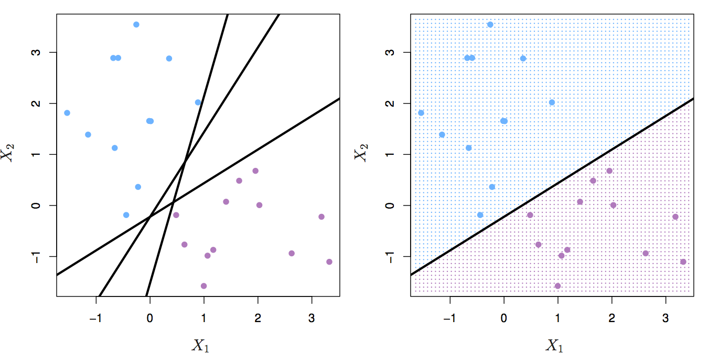
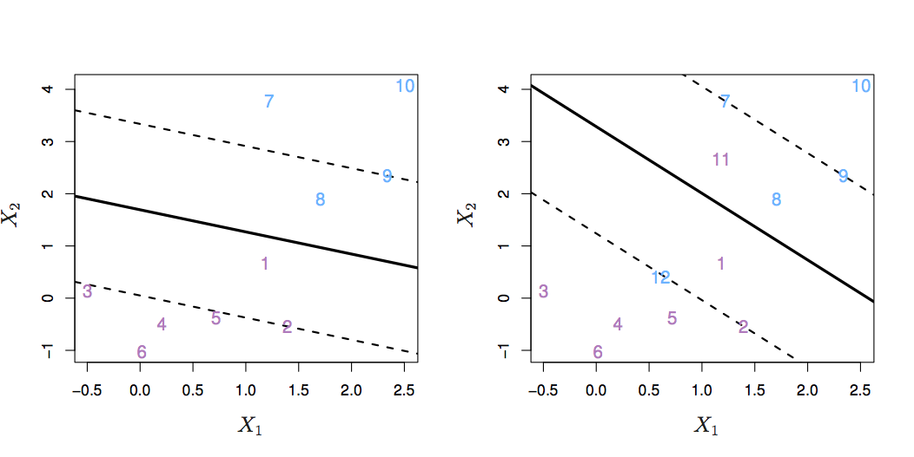
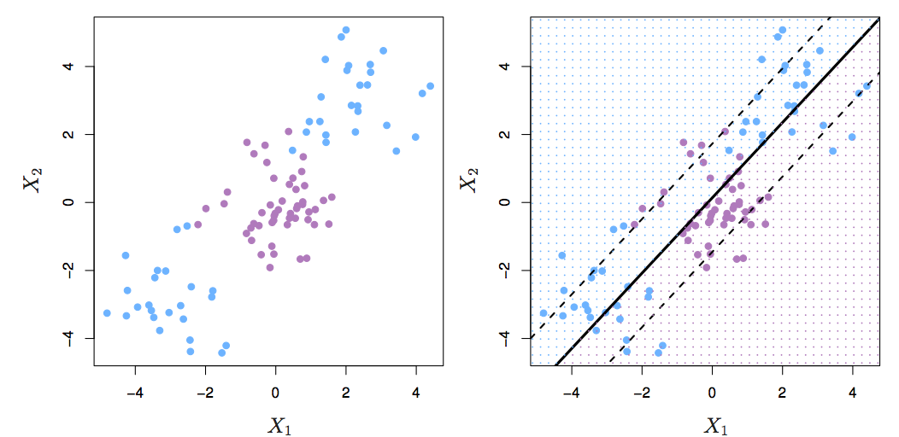
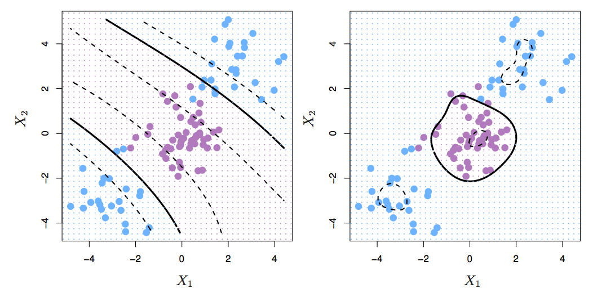

Support Vector Machine
========================================================
author: Héctor Corrada Bravo
date: CMSC498T: Intro. Data Science

State-of-the-art Classification Method
========================================================

Flexible, efficient method to learn classifiers

- Build upon linear methods
- Geometric interpretation (maximum margin)
- Can be built over _similarities_ between observations (more on this later)

Classification via Space Partitioning
========================================================

SVM also follows this framework


 

Linear Support Vector Machine
========================================================

**Two-class SVM**

Given training data: $\{(\mathbf{x}_1,y_1), (\mathbf{x}_2,y_2),\ldots,(\mathbf{x}_n,y_n)\}$

Where: 
- $\mathbf{x}_i$ is a vector of $p$ predictor values for $i$th observation
- $y_i$ is the class label (we're going to use +1 and -1)

Linear Support Vector Machine
===============================

Like logistic regression we define a _discriminative_ function such that

$$
\beta_0 + \beta_1 x_{i1} + \beta_2 x_{i2} + \cdots + \beta_p x_{ip} > 0 \, \mathrm{ if } y_i = 1
$$

and

$$
\beta_0 + \beta_1 x_{i1} + \beta_2 x_{i2} + \cdots + \beta_p x_{ip} < 0 \, \mathrm{ if } y_i = -1
$$

Note that points where _discriminative_ function equals 0 form a _hyper-plane_ (i.e., a line in 2D)

Linear Support Vector Machine
==============================



Linear Support Vector Machine
===============================

**The margin**: Distance between separating plane and nearest points.

 

Linear Support Vector Machine
==============================

_Key insights_

1. **Look for the maximum margin hyper-plane**
2. Only depends on a subset of observations (support vectors)
3. Only depends on pair-wise "similarity" functions of observations

Linear Support Vector Machine
==============================

**Look for the maximum margin hyper-plane**

Find the plane (think line in 2D) that separates training data with largest margin.

This will maybe _generalize_ better since new observations have room to fall within margin and still be classified correctly.

Linear Support Vector Machine
==============================

Also an _optimization_ problem (see _Numerical Methods_ or _Machine Learning_ class for details):

$$
\mathrm{max}_{\beta_0,\beta_1,\ldots,\beta_p} M \\
\mathrm{s.t} \sum_{j=1}^p \beta_p^2 = 1 \\
y_i(\beta_0 + \beta_1 x_{i1} + \ldots + \beta_p x_{ip}) \geq M \, \forall i
$$

Linear Support Vector Machine
==============================

_What if there is no separating hyper-plane?_

Penalize observations on the **wrong side of the margin**.

Linear Support Vector Machine
==============================



Linear Support Vector Machine
==============================

$$
\mathrm{max}_{\beta_0,\beta_1,\ldots,\beta_p} M \\
\mathrm{s.t} \sum_{j=1}^p \beta_p^2 = 1 \\
y_i(\beta_0 + \beta_1 x_{i1} + \ldots + \beta_p x_{ip}) \geq M(1-\epsilon_i) \, \forall i \\
\epsilon_i \geq 0 \, \forall i \\
\sum_{i=1}^n \epsilon_i \leq C
$$

$C$ is a parameter to be selected (model selection)

Linear Support Vector Machine
==============================

 


Linear Support Vector Machine
==============================

_Key insights_

1. Look for the maximum margin hyper-plane
2. **Only depends on subset of observations (support vectors)**
3. Only depends on pairwise "similarity" functions of observations

Linear Support Vector Machine
===============================

As a result of maximum-margin formulation, we only need observations that are on the "wrong" side of the margin to get $\beta$ values.

These are called _support vectors_

In general: Smaller $C \Rightarrow$ fewer SVs 

Linear Support Vector Machine
==============================

_Key insights_

1. Look for the maximum margin hyper-plane
2. Only depends on subset of observations (support vectors)
3. **Only depends on pairwise "similarity" functions of observations**

Linear Support Vector Machine
===============================

We can solve optimization problem only using inner products between observations (as opposed to the observations themselves)

_Inner product_: $\langle x_i, x_{i'} \rangle = \sum_{j=1}^p x_{ij}x_{i'j}$

We can write _discriminant_ function in equivalent form

$$
f(x) = \beta_0 + \sum_{i=1}^n \alpha_i \langle x, x_i \rangle
$$

By definition, $\alpha_i > 0$ **only** for SVs

Support Vector Machine
========================

How to do non-linear discriminative functions?



Support Vector Machine
==================================

We can generalize inner product using "kernel" functions that provide something like an inner product:

$$
f(x) = \beta_0 + \sum_{i=1}^n \alpha_i k(x, x_i)
$$

What is $k$?

Support Vector Machine
=======================

Two examples: 

- _Polynomial kernel_: $k(x,x_i) = 1+\langle x, x_i \rangle^d$

- _RBF (radial) kernel_: $k(x,x_i) = \exp\{-\gamma \sum_{j=1}^p (x_{j}-x_{ij})^2\}$


Support Vector Machine
=========================



Support Vector Machine
========================

 

Linear Support Vector Machine
==============================


```r
library(e1071)
library(ISLR)
data(Default)

n <- nrow(Default)
train_indices <- sample(n, n/2)

costs <- c(.01, 1, 100)
svm_fits <- lapply(costs, function(cost) {
  svm(default~., data=Default, cost=cost, kernel="linear",subset=train_indices)
})
```


Linear Support Vector Machine
==============================


|  cost| number_svs| train_error| test_error|
|-----:|----------:|-----------:|----------:|
| 1e-02|        352|        3.48|       3.18|
| 1e+00|        359|        3.48|       3.18|
| 1e+02|        364|        3.48|       3.18|

Non-linear Support Vector Machine
==============================


```r
costs <- c(.01, 1, 10)
gamma <- c(.01, 1, 10)
parameters <- expand.grid(costs, gamma)

svm_fits <- lapply(seq(nrow(parameters)), function(i) {
  svm(default~., data=Default, cost=parameters[i,1], kernel="radial", gamma=parameters[i,2], subset=train_indices)
})
```


Non-linear Support Vector Machine
==================================


|  cost| gamma| number_svs| train_error| test_error|
|-----:|-----:|----------:|-----------:|----------:|
|  0.01|  0.01|        348|        3.48|       3.18|
|  1.00|  0.01|        359|        3.48|       3.18|
| 10.00|  0.01|        352|        3.48|       3.18|
|  0.01|  1.00|        406|        3.48|       3.18|
|  1.00|  1.00|        432|        2.88|       2.46|
| 10.00|  1.00|        382|        2.78|       2.54|
|  0.01| 10.00|        498|        3.48|       3.18|
|  1.00| 10.00|       1131|        2.62|       2.88|
| 10.00| 10.00|        944|        2.30|       3.10|
