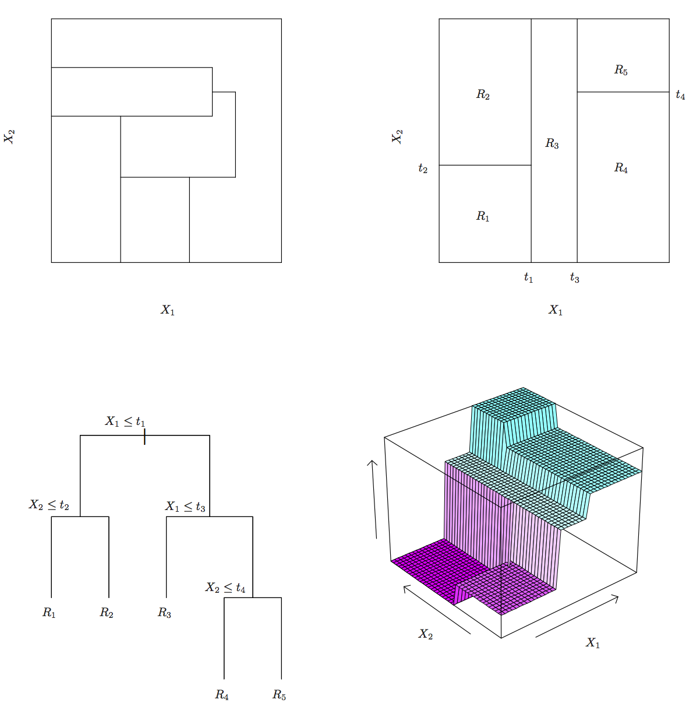
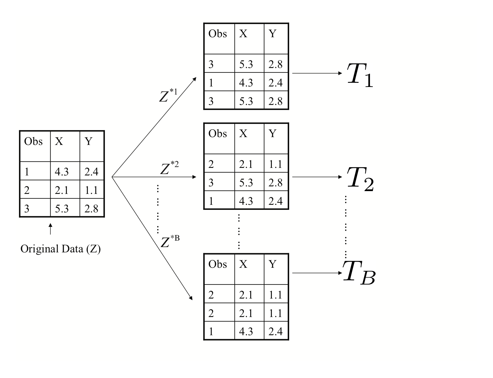

TreeMethods
========================================================
author: Hector Corrada Bravo
date: CADi 2015


Tree-Based Methods
====================

Very popular, well-known and studied methods in Statistical Learning

- Decision Tree Models
- Random Forests

Regression Trees
==================

 

***

 

Regression Trees
==================

 

***

 

Prediction by space partitioning
=================================

Prediction by partitioning feature (predictor) space.

1. Partition space into $J$ non-overlapping regions, $R_1, R_2, \ldots, R_J$.
2. For every observation that falls within region $R_j$, predict response as mean of response for training observations in $R_j$.

**Regression Trees create partition recursively**

Regression Trees
===================

1. Find predictor $j$ and value $s$ that minimize RSS:

$$
\sum_{i:\, x_i \in R_1(j,s))} (y_i - \hat{y}_{R_1})^2 +
\sum_{i:\, x_i \in R_2(j,s))} (y_i - \hat{y}_{R_2})^2
$$

Where $R_1$ and $R_2$ are regions resulting from splitting observations on predictor $j$ and value $s$:

$$
R_1(j,s) = \{X|X_j < s\} \mathrm{ and } R_2(j,s) \{X|X_j \geq s\}
$$

$\hat{y}_{R_j}$ is the mean of the response $Y$ of observations in $R_j$.

Regression Trees
=================



Regression Trees
=================

 

***

 

Regression Trees
=================

 

***

 

Regression Trees
=================

In R, built with similar interface as linear models


```r
library(tree)
library(ISLR)
data(Auto)

tree_fit <- tree(mpg~horsepower+weight, data=Auto)
predict(tree_fit)
```

Regression Trees
=================

- When do we stop partitioning? When adding a partition does not reduce RSS, or, when partition has too few training observations.
- Even then, trees built with this stopping criterion tend to _overfit_ training data.
- To avoid this, a post-processing step called _pruning_ is used to make the tree smaller:
  - **Question:** why would a smaller tree tend to generalize better?

Pruning Regression Trees
=========================

Given a large tree $T_0$, _cost complexity pruning_ looks for the subtree $T_{\alpha}$ that minimizes

$$
\sum_{m=1}^{|T|} \sum_{i:\, x_i \in R_m} (y_i-\hat{y}_{R_m})^2 + \alpha |T|
$$

given some positive value $\alpha$.

How to choose $\alpha$? Use cross-validation to select $\alpha$ that minimizes test-set RSS.
Make $T_{\alpha}$ the final tree.

Pruning Regression Trees
========================

 

***
  
 

Pruning Regression Trees
=========================

 

***
 

Pruning Regression Trees
=========================

 

***

 

Classification Trees
=====================

- Same partitioning principle, but now, each region predicts the majority class for training observations within region.
- Naive approach: looking for partitions that minimize training error
- Better performing approaches: look for partitions that minimize (for leaf $m$):
  - **Gini Index**: $\sum_{k=1}^K \hat{p}_{mk}(1-\hat{p}_{mk})$, or
  - **Entropy**: $-\sum_{k=1}^K \hat{p}_{mk}\log(\hat{p}_{mk})$
  
where $\hat{p}_{mk}$ is the proportion of training observations in partition $m$ labeled as class $k$.
- Both of these seek to partition observations into subsets that have the same labels.

Classification Trees
=====================

 

***

 

Classification Trees
=====================


```
node), split, n, deviance, yval, (yprob)
      * denotes terminal node

1) root 10000 2921.0 No ( 0.966700 0.033300 )  
  2) balance < 1472.99 9004  760.7 No ( 0.992892 0.007108 )  
    4) balance < 1099.01 7085  151.2 No ( 0.998589 0.001411 ) *
    5) balance > 1099.01 1919  492.1 No ( 0.971860 0.028140 ) *
  3) balance > 1472.99 996 1162.0 No ( 0.729920 0.270080 )  
    6) balance < 1856.76 786  721.0 No ( 0.828244 0.171756 ) *
    7) balance > 1856.76 210  274.9 Yes ( 0.361905 0.638095 ) *
```

Decision Trees
===============

Advantages

- Highly interpretable, even moreso than linear models  
- Easy to visualize (if small enough)  
- Maybe models human decision processes?  
- No dummy predictors for categorical variables

Decision Trees
===============

Disadvantages

- Greedy approach via recursive partitioning
- Not always best performing (not very flexible)
- Highly unstable to changes in training data

Random Forests
===============

A **very popular** approach that addresses these shortcomings via resampling:

Goal is to improve prediction performance and reduce instability by _averaging_ multiple decision trees (a forest constructed with randomness)

Random Forests
===============

First trick: *Bagging* (bootstrap aggregation)
General scheme:
  1. Build many decision trees $T_1, T_2, \ldots, T_B$ from training set
  2. Given a new observation, let each $T_j$ predict $\hat{y}_j$
  3. For regression: predict average $\frac{1}{B} \sum_{j=1}^B \hat{y}_j$,
     for classification: predict with majority vote (most frequent class)
     
But wait, how do we get many decision trees from a single training set?

Bootstrap
=========

To create $T_j, \, j=1,\ldots,B$ from training set of size $n$:

a) create a bootstrap training set by sampling $n$ observations from training set **with replacement**
b) build a decision tree from bootstrap training set

Bootstrap
==========



Random Forests
===============

Second trick: random selection of features to split!

When building each tree $T_j$, at each recursive partition only consider a randomly selected subset of predictors to check for best split

  - This reduces correlation between trees in forest, improving prediction accuracy

Random Forests
================


```
Error in library(randomForest) : 
  there is no package called 'randomForest'
```
